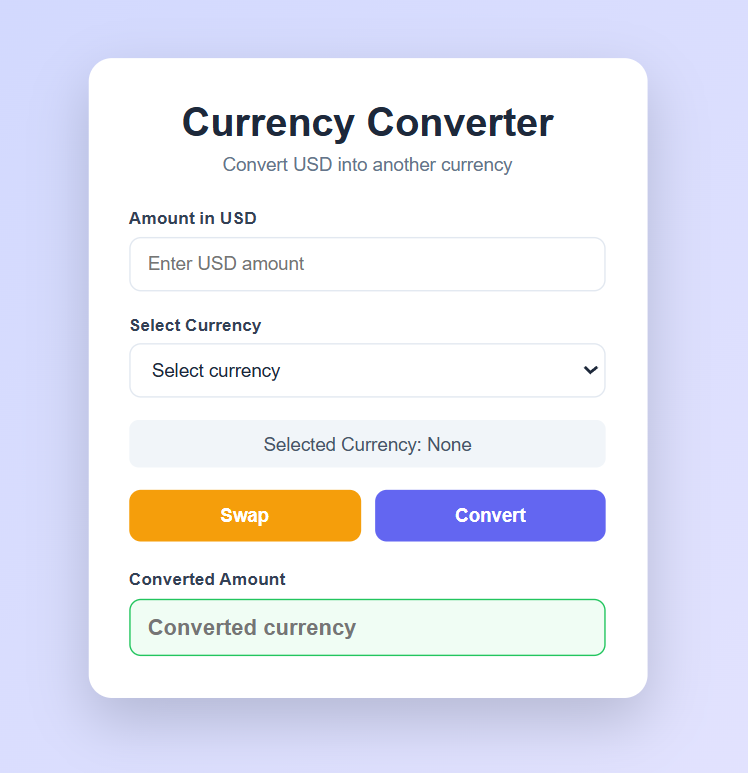

# 💱 Currency Converter

A simple and responsive **Currency Converter** built with **React.js** that converts **USD** into multiple international currencies using real-time exchange rates from the **Frankfurter API**.

---

## 🚀 Features

* 🌍 Real-time currency conversion
* 💵 Convert USD to multiple currencies
* 🔄 Swap input and converted values
* ⚡ Built using React Hooks
* 📡 Fetches live exchange rates using the Frankfurter API
* 📱 Responsive and clean UI

---

## 🛠️ Tech Stack

* React.js
* JavaScript (ES6+)
* HTML5
* CSS3
* Frankfurter API

---

## 📂 Project Structure

```text
src/
│── assets/
│── App.jsx
│── App.css
│── index.css
│── main.jsx
```

---

## 📦 Installation

Clone the repository

```bash
git clone https://github.com/Aayush60-del/Currency_Converter.git
```

Navigate to the project

```bash
cd Currency_Converter
```

Install dependencies

```bash
npm install
```

Start the development server

```bash
npm run dev
```

---

## 🌐 API Used

This project uses the **Frankfurter API** to retrieve real-time exchange rates.

Example:

```text
https://api.frankfurter.dev/v1/latest?base=USD&symbols=INR
```

---

## 📸 Preview



> Replace the image above with a screenshot of your application after deployment.

---

## 🎯 Future Improvements

* Convert between any two currencies
* Add "From" and "To" currency selectors
* Currency search functionality
* Exchange rate history
* Dark/Light mode
* Display conversion rate information
* Error handling and loading spinner
* Favorite currencies

---

## 👨‍💻 Author

**Ayush Negi**

* GitHub: https://github.com/Aayush60-del
* LinkedIn: https://www.linkedin.com/in/aayush-negi-a08367334

---

## ⭐ Show Your Support

If you found this project helpful, consider giving it a ⭐ on GitHub.
